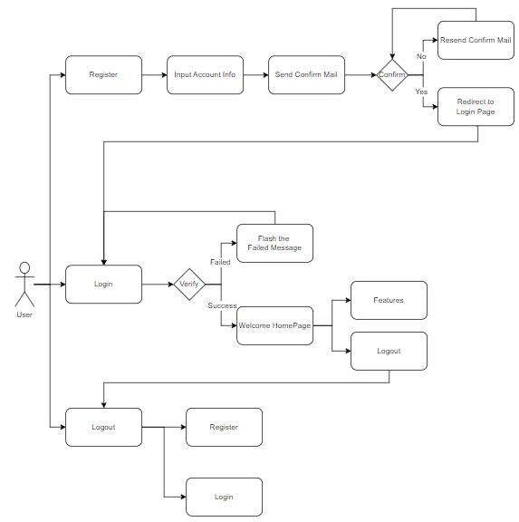

# flask_blueprint

### Introduction
Register and Login/Logout page connect mySQL with flask, and seperate files with flask-blueprint firmwork

### Folder tree

``` bash
│  image-1.png
│  image.png
│  main.py
│  Pipfile
│  Pipfile.lock
│  README.md
│
└─user
    │  auth.py
    │  email.py
    │  models.py
    │  token.py
    │  views.py
    │  __init__.py
    │
    ├─static
    │  ├─css
    │  │      login.css
    │  │      manage.css
    │  │      register.css
    │  │
    │  └─js
    │          script.js
    │
    └─templates
            confirm_email.html
            index.html
            login.html
            mail.html
            mailSend..html
            manage.html
            register.html
```

### Website process
register and confirm -> send data with flask -> sve into database(mySQL) -> client: it will jump to the login page, and then you can login with your username and password / auth: you can see all accounts data in manage page, and you can edit every account as well

### Use Case Diagram(draw.io)


link: https://drive.google.com/file/d/1pV-x2oEkinEvHB7fMI3PLtsO4bfsrWJM/view?usp=sharing

### Password hashed
Use werkzeug hash function to make users' password hashed and secret.
You can see functions in __init__.py

### Show database's `user` table
#### In phpmyadmin by xampp


#### Make the web CMS by myself(page in manage.html)


### RF
> 1. https://blog.csdn.net/m0_45319424/article/details/125574439
> 2. https://roytuts.com/delete-multiple-rows-from-table-using-flask-ajax-jquery-mysql/#google_vignette
> 3. https://hackmd.io/@shaoeChen/HJiZtEngG/https%3A%2F%2Fhackmd.io%2Fs%2FSJmhFpXmf
> 4. https://medium.com/seaniap/python-web-flask-%E4%BD%BF%E7%94%A8%E9%9D%9C%E6%85%8B%E6%AA%94%E6%A1%88-ac00e863a470
> 5. https://ithelp.ithome.com.tw/articles/10185668
> 6. https://ithelp.ithome.com.tw/articles/10294537
> 7. https://im1010ioio.hashnode.dev/css-white-space-word-breakline-clamp
> 8. https://www.youtube.com/watch?v=4TUsq4GizXk